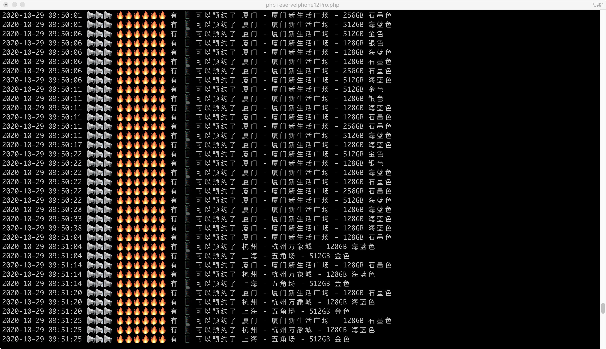

# reserveIphone12Pro

[English](./README.md) | [简体中文](./README.zh-CN.md)

---

## 项目简介

一个用于查询 iPhone 12 Pro 和 iPhone 12 Pro Max 是否存在可预约库存的脚本工具。

适用于不想手动刷新官网、需要快速监控库存状态的场景。

---

## 运行环境

- PHP > 7.0（需要 `php-curl` 扩展）
- Python > 3.8（需要 `requests` 库）

---

## 安装说明

### PHP

确认已开启 `php-curl`：

```shell
php -m | grep curl
```

### Python

安装依赖：

```shell
pip install requests
```

---

## 使用方法

### iPhone 12 Pro

```shell
php /你的路径/项目目录/php/reserveIphone12Pro.php
```

### iPhone 12 Pro Max

```shell
php /你的路径/项目目录/php/reserveIphone12ProMax.php
```

### Python 版本（实验性）

```shell
python /你的路径/项目目录/python/query_iphone.py
```

---

## 输出说明

- 有库存：显示可预约信息
- 无库存：提示无可用库存

---

## 运行截图


